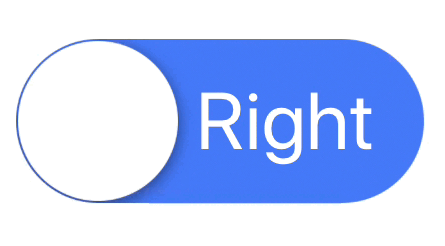

# LabelSwitch

[](https://travis-ci.org/Cookiezby/LabelSwitch)
[](http://cocoapods.org/pods/LabelSwitch)
[](http://cocoapods.org/pods/LabelSwitch)
[](http://cocoapods.org/pods/LabelSwitch)



## Installation

LabelSwitch is available through [CocoaPods](http://cocoapods.org). To install
it, simply add the following line to your Podfile:

```ruby
pod 'LabelSwitch'
```

## Usage

You can create the view through code or InterfaceBuilder

```swift
let ls = LabelSwtichSetting(text: "Text1",
                       textColor: .white,
                            font: UIFont.boldSystemFont(ofSize: 15),
                 backgroundColor: .red)
        
let rs = LabelSwtichSetting(text: "Text2",
                       textColor: .white,
                            font: UIFont.boldSystemFont(ofSize: 20),
                 backgroundColor: .green)

// Set the default state of the switch,
let labelSwitch = LabelSwitch(center: .zero, leftSetting: ls, rightSetting: rs, defaultState: .L)

// Set the appearance of the circle button
labelSwitch.circleShadow = false
labelSwitch.circleColor = .red

// Make switch be triggered by tapping on any position in the switch
labelSwitch.fullSizeTapEnabled = true

// Set the delegate to inform when the switch was triggered
labelSwitch.delegate = self

extension ViewController: LabelSwitchDelegate {
    func switchChangToState(_ state: SwitchState) {
        switch state {
            case .L: print("circle on left")
            case .R: print("circle on right")
        }
    }
}

```

## Author

cookiezby@gmail.com

## License

LabelSwitch is available under the MIT license. See the LICENSE file for more info.
